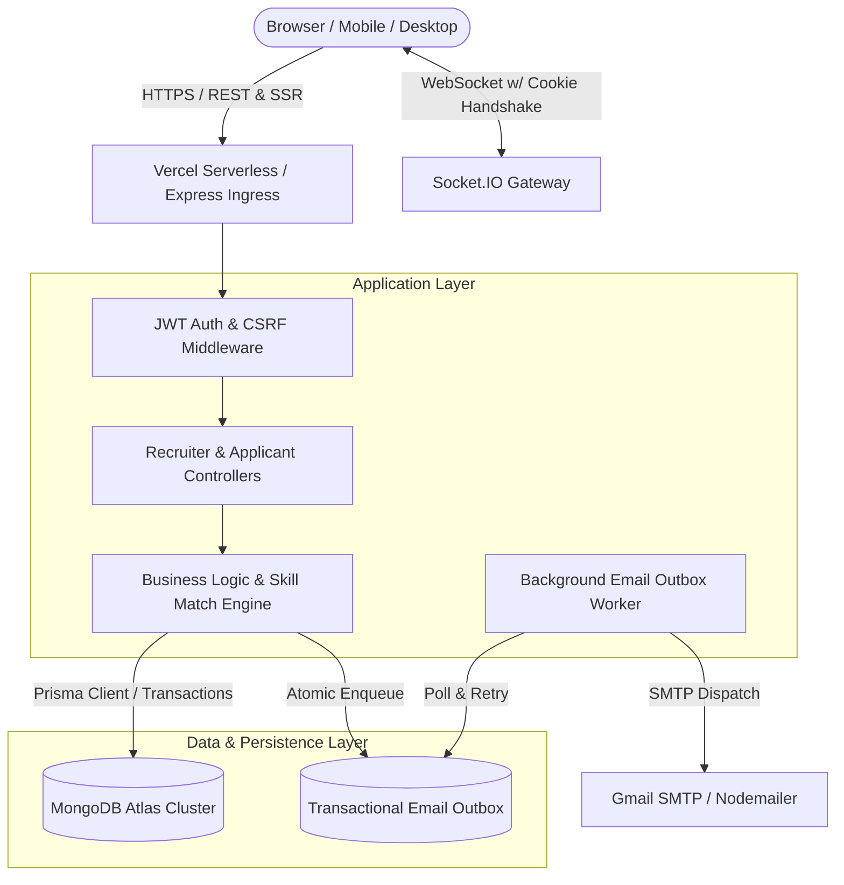

# 💼 EasilyJob — Enterprise Job Portal & Real-time Hiring Platform

[](https://nodejs.org/)
[](https://expressjs.com/)
[](https://www.prisma.io/)
[](https://www.mongodb.com/atlas)
[](https://socket.io/)
[](https://easilyjob.vercel.app)
[](LICENSE)

A modern, high-performance, full-lifecycle hiring and recruitment platform built with **Node.js (ESM)**, **Express 5**, **Prisma ORM**, **MongoDB Atlas**, **Socket.IO**, and **EJS**. 

EasilyJob connects recruiters and job seekers through dynamic skill-matching, multi-round interview pipelines with scoring rubrics, real-time messaging, and failure-resilient transactional email notifications.

🌐 **Live Demo:** [easilyjob.vercel.app](https://easilyjob.vercel.app)  
📁 **Technical Showcase:** [RESUME_PROJECT_SHOWCASE.md](./RESUME_PROJECT_SHOWCASE.md)

---

## ✨ Key Features

### 🏢 1. Recruiter Workspace & Candidate Pipeline
- **Job Creation & Lifecycle:** Manage openings with tags, categories, vacancies, expiration dates, and custom required skill arrays.
- **Visual Application Stepper:** Track applicants through structured stages (`NEW` ➔ `REVIEWING` ➔ `SHORTLISTED` ➔ `INTERVIEW_SCHEDULED` ➔ `INTERVIEWED` ➔ `HIRED` / `REJECTED`).
- **Interactive Scoring Rubrics:** Private recruiter evaluation scorecards (Technical, Communication, Overall 0–100 scores + `STRONG_YES` / `YES` / `MAYBE` / `NO` recommendations).
- **Public-Safe Decision Sharing:** Share constructive feedback with applicants while strictly protecting internal interviewer notes and ratings.
- **Audit Trail History:** Complete timeline tracking stage transitions with timestamps and recruiter notes.

### 🧑‍💻 2. Candidate Portal & Experience
- **Smart Skill Matching:** Live compatibility calculation comparing candidate profile skills, years of experience, and location against target job requirements.
- **Application Tracking:** Real-time visibility into scheduled interview rounds, Google Meet links, physical venue details, and hiring decisions.
- **Profile & Resume Management:** One-click application flow with automated resume parsing and instant application receipt notifications.

### 💬 3. Real-Time Chat & Automated Bot Notifications
- **Dual-Tier Real-Time Messaging:** Powered by **Socket.IO** with cookie-authenticated handshakes and an automatic **HTTP POST fallback** for 100% message reliability on serverless/unstable connections.
- **Automated Workflow Bot:** Automatically dispatches instant chat alerts into direct candidate rooms upon interview scheduling, rescheduling, and final decision sharing.

### 📧 4. Transactional Email Outbox Architecture
- **Failure-Resilient Email Queue:** Employs the **Transactional Outbox Pattern** with deterministic idempotency keys (`INTERVIEW_RESULT:${id}`), background retry workers, and exponential backoff.
- **Branded HTML Notifications:** Tailored email notifications for email verification, application submissions, interview invitations, celebration offer letters (🎉 HIRED), and empathetic status updates (📋 REJECTED).

### 🛡️ 5. Enterprise Security & Session Hardening
- **Stateless Dual JWT Session Engine:** Short-lived Access Tokens (15m) paired with rotating Refresh Tokens (7d) stored in strictly isolated `httpOnly`, `SameSite=Lax`, `Secure` cookies.
- **Defense in Depth:** Double-submit **CSRF protection**, **Helmet** security headers, strict input sanitization via **express-validator**, and brute-force **Rate Limiting**.
- **Tenant Isolation:** Enforced data boundaries at the repository layer, preventing Insecure Direct Object References (IDOR).

---

## 🏛️ System Architecture



---

## 🛠️ Tech Stack Matrix

| Domain | Technologies |
| :--- | :--- |
| **Backend Framework** | Node.js (v20+ ESM), Express.js (v5) |
| **Database & ORM** | MongoDB Atlas, Prisma ORM (v5.22, multi-folder schema) |
| **Authentication & Security** | JWT (jsonwebtoken), bcryptjs, Helmet, CSRF tokens, express-rate-limit |
| **Real-time & Communications**| Socket.IO (v4.8), Nodemailer (Transactional Outbox Worker) |
| **Templating & UI** | EJS, Express EJS Layouts, Vanilla CSS Design System, Dark/Light Mode Engine |
| **Deployment & Hosting** | Vercel Serverless, Git CI/CD |

---

## 📁 Repository Structure

```text
├── api/
│   └── index.js              # Vercel serverless entrypoint
├── config/
│   ├── env.js                # Environment configuration & secret fallbacks
│   ├── prisma.js             # Singleton Prisma client instance
│   └── socket.js             # Socket.IO initialization & cookie auth
├── controllers/              # Business controllers (applicant, recruiter, job, chat, auth)
├── middleware/               # Auth, CSRF, rate-limit, flash, upload, error handlers
├── policies/                 # State-machine transition policies (applications, interviews)
├── prisma/
│   └── schema/               # Multi-folder Prisma schema (user, job, app, interview, chat, email)
├── public/                   # Static assets, CSS design tokens, icons, and client JS
├── repositories/             # Data access layer with tenant isolation
├── routes/                   # Modular Express route tree
├── services/                 # Business services (interview, chat, outbox, skillMatch, email)
├── views/                    # EJS templates (layouts, recruiter workspace, applicant portal)
├── workers/                  # Background email outbox worker
├── app.js                    # Main Express application assembly
├── vercel.json               # Vercel deployment configuration
└── package.json              # Dependencies and scripts
```

---

## 🚀 Quick Start (Local Development)

### 1. Prerequisites
- Node.js (>= 18.0.0)
- npm (>= 9.0.0)
- MongoDB Database (Local or MongoDB Atlas cluster URI)

### 2. Clone Repository
```bash
git clone https://github.com/sanjib45/Easilyjob.git
cd Easilyjob
```

### 3. Install Dependencies
```bash
npm install
```
*(This automatically runs `prisma generate` via the `postinstall` script).*

### 4. Configure Environment Variables
Create a `.env` file in the root directory:
```bash
cp .env.example .env
```
Fill in your configuration:
```env
PORT=3000
NODE_ENV=development
APP_URL=http://localhost:3000
DATABASE_URL="mongodb+srv://<username>:<password>@cluster.mongodb.net/easilyjob?retryWrites=true&w=majority"

# Security Secrets (Must be at least 32 characters in production)
JWT_ACCESS_SECRET="generate-with-crypto-randomBytes-32-hex"
JWT_REFRESH_SECRET="generate-with-crypto-randomBytes-32-hex"
COOKIE_SECRET="generate-with-crypto-randomBytes-32-hex"
SESSION_SECRET="generate-with-crypto-randomBytes-32-hex"

# Email Configuration (Optional for local dev)
EMAIL_SERVICE=gmail
EMAIL_USER=your-email@gmail.com
EMAIL_PASS=your-google-app-password
EMAIL_FROM="Easily Jobs <your-email@gmail.com>"
```

### 5. Launch the Development Server
```bash
npm run dev
```
Open [http://localhost:3000](http://localhost:3000) in your browser.

---

## 🌐 Deploying to Vercel

1. Push your repository to GitHub (`main` branch).
2. Go to [vercel.com](https://vercel.com) and import the repository.
3. In **Project Settings** ➔ **Environment Variables**, add:
   - `DATABASE_URL` (MongoDB Atlas URI)
   - `JWT_ACCESS_SECRET`, `JWT_REFRESH_SECRET`, `COOKIE_SECRET`, `SESSION_SECRET`
   - `EMAIL_SERVICE`, `EMAIL_USER`, `EMAIL_PASS`, `EMAIL_FROM`
   - `NODE_ENV=production`
   - `APP_URL=https://your-vercel-domain.vercel.app`
4. In MongoDB Atlas ➔ **Network Access**, ensure `0.0.0.0/0` is added to the IP Access List.
5. Click **Deploy**.

---

## 🔒 Security Best Practices Implemented

- **No Passwords in Plaintext:** Hashed with bcrypt (12 salt rounds).
- **Anti-CSRF Tokens:** Verified on every state-changing request (`POST`, `PUT`, `DELETE`).
- **XSS Protection:** Content escaping in EJS views and `httpOnly` flags on session/auth cookies.
- **Tenant Authorization:** All queries explicitly scope ownership to `req.user.id`.
- **Rate Limiting:** Protects authentication and application routes against brute-force attacks.

---

## 📄 License

This project is licensed under the [ISC License](LICENSE).

---

Developed with ❤️ by **[Sanjib Santra](https://github.com/sanjib45)**.  
*Feedback, bug reports, and contributions are welcome!*
