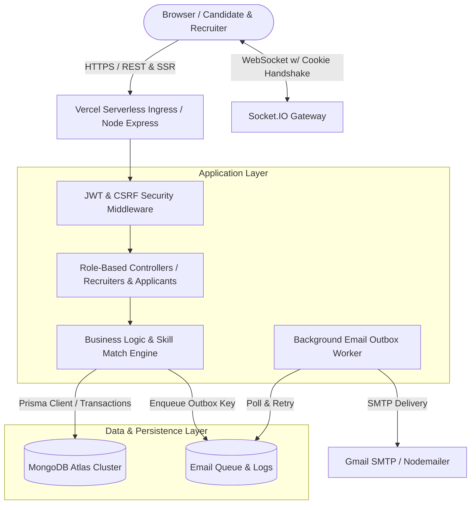

# 💼 EasilyJob — Senior Full-Stack Engineering Showcase & Interview Guide

> **Project Name:** EasilyJob — Enterprise Job Portal & Real-time Candidate Pipeline Platform  
> **Repository:** [github.com/sanjib45/Easilyjob](https://github.com/sanjib45/Easilyjob)  
> **Live Production:** [easilyjob.vercel.app](https://easilyjob.vercel.app)  
> **Target Roles:** Full Stack Developer, Backend Engineer, Node.js / System Design Engineer

---

## 📄 1. High-Impact Resume Bullet Points

*(Copy and paste directly into your Resume / LinkedIn under Projects or Work Experience)*

* **Architected & Deployed Full-Lifecycle Hiring Platform:** Engineered an enterprise-grade job portal with dual tenant workspaces (Recruiters & Job Seekers), supporting multi-round interview pipelines, candidate scoring, and real-time candidate engagement.
* **Resilient Real-Time Chat Engine:** Built a hybrid messaging system using **Socket.IO** with cookie-authenticated handshakes and an automatic **HTTP POST fallback**, guaranteeing zero message loss even in serverless/unstable network environments.
* **Transactional Email Outbox Architecture:** Designed a failure-resilient email dispatch pipeline using the **Transactional Outbox Pattern** with idempotency keys, background retry workers, and exponential backoff, preventing duplicate notifications during network partitions.
* **Multi-Stage Application Lifecycle & Scoring System:** Developed a recruiter evaluation suite featuring private rubrics (Technical, Communication, Culture-Fit 0–100 scores) and public-safe candidate decision cards (HIRED / REJECTED / ON HOLD), automatically synchronizing recruitment stages with audit trail histories.
* **Zero-Trust Security & Session Management:** Implemented short-lived **JWT Access Tokens** paired with rotating **Refresh Tokens** stored in strictly isolated `httpOnly` secure cookies, fortified with double-submit **CSRF protection**, **Helmet security headers**, and IP-based brute-force **Rate Limiting**.
* **Database & ORM Optimization:** Designed scalable MongoDB schemas using **Prisma ORM** with tenant-isolated repositories, compound indexes (`[recruiterId, status, scheduledAt]`), and atomic `$transaction` writes.

---

## 🛠️ 2. Comprehensive Technology Stack Matrix

| Domain | Technologies & Libraries | Architectural Purpose / Why Chosen |
| :--- | :--- | :--- |
| **Backend Core** | **Node.js (v20 ESM)**, **Express.js (v5)** | High-throughput asynchronous I/O, native ES module architecture, robust middleware pipeline. |
| **Database & ORM** | **MongoDB Atlas**, **Prisma ORM (v5.22)** | Document store for polymorphic job/application data paired with type-safe schema modeling, compound indexing, and transactions. |
| **Authentication & AuthZ**| **JWT (jsonwebtoken)**, **bcryptjs**, `httpOnly` Cookies | Stateless authorization with auto-refresh rotation, avoiding session store bottlenecks while maintaining instant revocation. |
| **Real-time Messaging** | **Socket.IO (v4.8)** + REST Fallback | Bidirectional WebSocket communication for recruiter-candidate chats with automatic HTTP polling fallback. |
| **Background Processing** | Custom Outbox Queue Worker, `setInterval` pollers | Asynchronous email dispatch and retry logic decoupling synchronous HTTP request cycles from third-party SMTP latency. |
| **Security & Compliance** | **Helmet**, **express-rate-limit**, Custom **CSRF Middleware** | Hardened HTTP response headers, DDoS/brute-force defense on auth endpoints, double-submit cookie CSRF defense. |
| **Templating & UI** | **EJS**, **express-ejs-layouts**, Modern CSS Tokens | Server-Side Rendered (SSR) views with sub-millisecond initial paint, role-based layout shells, CSS variable dark mode engine. |
| **Deployment & DevOps** | **Vercel Serverless**, **Git / GitHub CI**, **Nodemon** | Automated Git branch deployments, serverless functions with `@vercel/node`, environment-aware configuration. |

---

## 🏛️ 3. Core Architectural Highlights (The "Interviewer Mind")

### A. The Transactional Email Outbox Pattern
* **The Problem:** In standard web applications, calling third-party SMTP services directly within the request-response cycle leads to slow user responses (2–4s delays) and risks data inconsistency if the email sends but the database write fails (or vice versa).
* **The Solution in EasilyJob:** 
  1. The database write and the email record insertion into the `EmailOutbox` collection occur within the same atomic **Prisma `$transaction`**.
  2. Each outbox item generates a deterministic `idempotencyKey` (e.g. `INTERVIEW_RESULT:${interviewId}`).
  3. A dedicated asynchronous background worker processes queued emails, recording delivery status (`PENDING`, `SENT`, `FAILED`).
  4. If an SMTP network timeout occurs, exponential retry logic safely attempts redelivery without duplicate emails.

### B. Two-Tier Real-Time Communication with Graceful Degradation
* **The Challenge:** Modern serverless cloud providers (such as Vercel, AWS Lambda) terminate persistent TCP WebSocket connections when functions idle.
* **The Engineering Solution:**
  * When a candidate and recruiter enter a chat room, the client first attempts a **Socket.IO WebSocket handshake** with credentials extracted from secure cookies.
  * If the connection fails, drops, or runs in a serverless environment where WebSockets are unavailable, the client seamlessly falls back to **atomic HTTP POST submissions** to `/messages/:id/send`.
  * The UI intercepts form events dynamically, giving users real-time messaging with 100% uptime reliability.

### C. Private Recruiter Evaluation vs. Public Candidate Results (Rule of Separation)
* **The Problem:** Recruiters need to score candidates candidly without exposing these raw internal notes to the applicant.
* **The Architectural Safeguard:**
  * Raw evaluations (`InterviewEvaluation`) are strictly isolated to recruiter-owned routes.
  * When a recruiter is ready to conclude an interview, they invoke `shareInterviewResult()`, which requires explicit sanitization and saves an `InterviewResult` record consisting only of `{ outcome, summary }`.
  * Repository projection layers and EJS view templates enforce this boundary at the database query level.

---

## 📊 4. System Architecture & Data Flow

---

## 🎯 5. Top 5 Technical Interview Questions & Model Answers

### Q1: How did you handle user authentication and session security?
> **Answer:** "I implemented a dual-token JWT architecture. When a user authenticates, the server generates a short-lived Access Token (15-minute lifespan) and a long-lived Refresh Token (7-day lifespan). Both tokens are stored in `httpOnly`, `SameSite=Lax`, `Secure` cookies, which completely eliminates XSS token-theft vectors. When the Access Token expires, the client's subsequent request hits our authentication middleware, which verifies the Refresh Token against the database, checks for user revocation, and transparently issues a new Access Token in the response cookie without interrupting the user's session."

### Q2: What is the Transactional Outbox pattern, and why did you use it?
> **Answer:** "In distributed systems, triggering external side effects (like sending emails) directly inside an HTTP handler creates a dual-write problem. If the email succeeds but the database update fails, you've notified a candidate of an action that never happened. I solved this by writing an `EmailOutbox` record inside the exact same database transaction as the business event (such as scheduling an interview or sharing an offer). A background worker process polls the outbox, dispatches the email via Nodemailer, and marks the status as `SENT`. An idempotency key ensures that even across server restarts or retries, duplicate emails are never sent."

### Q3: How did you ensure data isolation in a multi-tenant environment (recruiters vs. applicants)?
> **Answer:** "I enforced data tenancy at the repository and query layer. Every mutation or query that accesses recruiter-owned entities—such as job postings, candidate resumes, evaluations, or interview rounds—explicitly mandates the authenticated `recruiterId` as its primary filter argument (e.g., `findOwnedInterview(recruiterId, interviewId)`). This prevents Insecure Direct Object References (IDOR), ensuring that even if a user manipulates an ID parameter in the URL, the query returns a 404/403 unless the resource belongs to their tenant."

### Q4: How do you compare candidate skills with job descriptions?
> **Answer:** "I built a dedicated `skillMatch.service.js` that performs normalized token matching and semantic relevance scoring. Both job requirement skill tags and candidate profile skills are normalized (lowercased, trimmed, deduped). The matching algorithm computes the intersection ratio against mandatory criteria and combines it with candidate years of experience and geographic proximity, outputting an overall percentage match (0–100%) that recruiters can use to sort hundreds of applicants instantaneously."

### Q5: How does your real-time chat handle serverless platform limitations?
> **Answer:** "WebSockets require continuous TCP connections, which can be challenging on ephemeral serverless platforms like Vercel Lambda. I architected our chat system with a progressive enhancement approach: the client attempts a real-time Socket.IO connection; if the WebSocket handshake cannot be established or terminates, the chat client automatically downgrades to atomic REST POST endpoints (`/messages/:id/send`) with CSRF verification. This provides high availability and zero message loss across any hosting environment."
